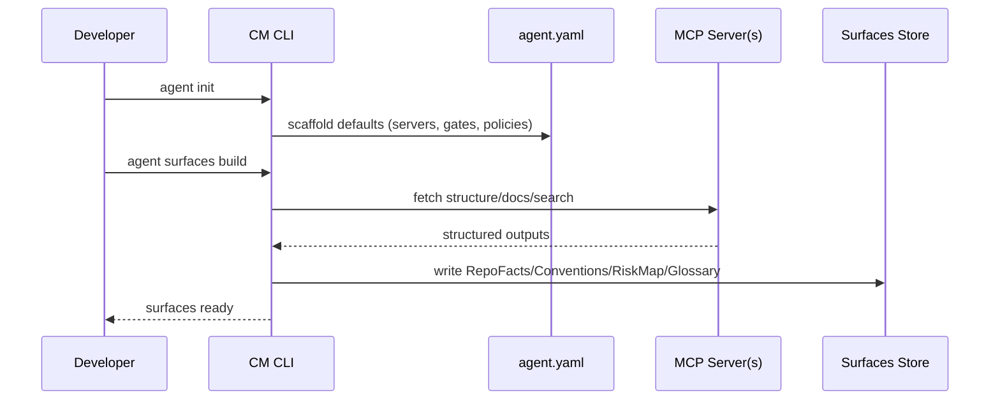
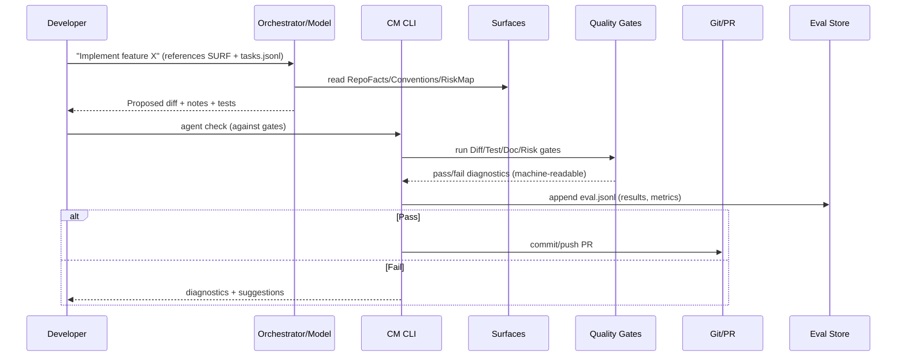
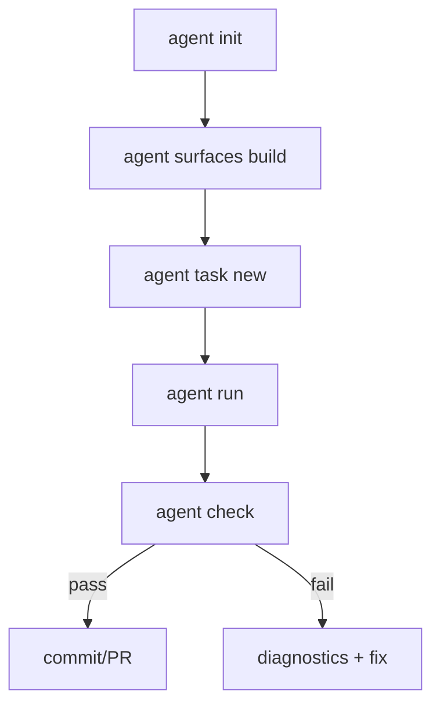
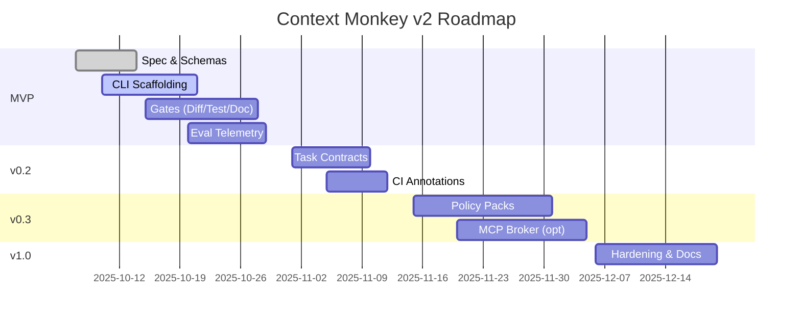
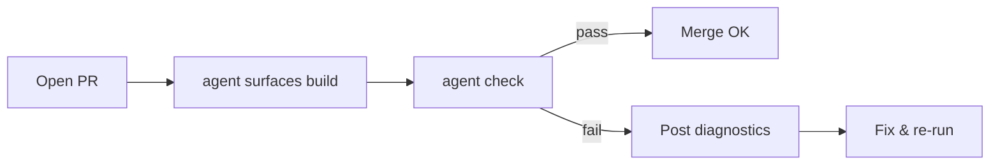

# Context Monkey v2 — Product Requirements Document (PRD)

**Status:** Draft v0.1  
**Owner:** Rich Haase (creator)  
**Date:** 2025-10-07  
**Repo:** `context-monkey` (revived as **Agent‑Ops layer atop MCP**)

---

## 0) Executive Summary — The Why

Modern models and Model Context Protocol (MCP) servers (e.g., code/doc providers) commoditize _context fetching_. A new **Context Monkey v2** should not duplicate that work. Instead, it should provide a **thin, durable Agent‑Ops layer** that:

- Encodes **policy, quality gates, and consent** across tools and repos.
- Produces **deterministic context surfaces** (JSON) that any agent can use.
- Enforces **task contracts** with measurable outcomes and **eval telemetry**.
- Remains **model‑agnostic** and **editor‑agnostic** via MCP.

In short: **Protocol > Prompt.** Context Monkey becomes the **guardrails and glue** that make agent work reproducible, auditable, and safe—no matter which model or MCP server you use.

---

## 1) Goals & Non‑Goals

### Goals

1. **Repo‑local contract** (`agent.yaml`) describing tools, MCP servers, policies, and quality gates.
2. **Deterministic context surfaces** under `/.agent/surfaces/` (e.g., `RepoFacts.json`).
3. **Task contracts** (`tasks.jsonl`) with acceptance criteria; **automatic gate enforcement**.
4. **Evaluation & telemetry** (`eval.jsonl`) to measure correctness, performance, and cost.
5. **MCP‑first**: use existing MCP servers; provide a minimal broker/adapter only when necessary.
6. **Editor/Model agnostic**: usable from Cursor, Claude Code, VS Code, JetBrains, CLI.

### Non‑Goals

- Building another docs/index MCP server if one exists already.
- Lock‑in to a single IDE, vendor, model, or orchestration framework.
- Long‑running autonomous agents. (Focus on **deterministic, human‑in‑the‑loop loops**.)

---

## 2) Core Concepts

- **Agent Bootstrap Profile (ABP)**: `agent.yaml` — policy, allowed MCP servers/tools, quality gates.
- **Context Surfaces**: Deterministic JSON bundles (RepoFacts, Conventions, RiskMap, Glossary).
- **Task Contract**: Atomic tasks with acceptance criteria & rollback notes → becomes the spec.
- **Quality Gates**: Diff/Test/Doc/Risk gates executed per task/PR.
- **Eval Telemetry**: JSON lines for reproducibility and cross‑model comparison.

---

## 3) System Overview (Mermaid)

### 3.1 High‑Level Architecture (Flowchart)

```mermaid
flowchart LR
  U[User/Developer] -->|goals & commands| CLI[Context Monkey CLI]
  CLI --> ABP[agent.yaml]
  ABP --> POL[Policy & Consent Gate]
  POL -->|allowed| BRK[MCP Broker (optional)]
  POL -- direct --> SRV[(MCP Servers)]
  BRK --> SRV
  SRV --> SURF[/.agent/surfaces/*.json]
  SURF --> ORCH[Your Orchestrator / IDE Agent / Model]
  ORCH --> TASKS[/.agent/tasks.jsonl]
  ORCH --> DIFF[Proposed Diff/Patch]
  CLI --> GATES[Quality Gates]
  GATES -->|validate| DIFF
  GATES --> EVAL[/.agent/eval.jsonl]
  DIFF -->|commit| VCS[(Git/PR)]
  EVAL -->|signals| U
```

### 3.2 Bootstrap Sequence



### 3.3 Task Run + Gate Enforcement



---

## 4) User Stories

1. **As a developer**, I can initialize a repo with `agent.yaml` and surfaces so agents know the rules and structure before making changes.
2. **As a reviewer**, I see small, reversible diffs that pass gates automatically, with a clear risk/rollback note.
3. **As a team lead**, I can update policy once and have all agents follow it across repos.
4. **As an experimenter**, I can compare models by reading `eval.jsonl` without changing my workflow.

---

## 5) Functional Requirements

### 5.1 Agent Bootstrap Profile (`agent.yaml`)

- Declare **MCP servers** (name, endpoint, version), **tool scopes**, **rate limits**, **allow/deny file patterns**.
- Configure **quality gates** and **severity** per repo/org.
- Reference **prompt recipes** (optional, parametric).

**Example:**

```yaml
version: 1
name: my-repo
mcp:
  servers:
    - id: docs
      endpoint: http://localhost:7337
      allow_tools: [repo.map, repo.search, doc.get]
    - id: git
      endpoint: http://localhost:7338
      allow_tools: [vcs.diff, vcs.apply, vcs.branch]
policy:
  allow_paths: ['src/**', 'tests/**']
  deny_paths: ['secrets/**', '.env*']
  rate_limits:
    repo.search: { rpm: 60, burst: 10 }
gates:
  diff:
    require_minimal: true
    enforce_conventions: true
  test:
    command: 'bun test'
    must_pass: true
    coverage_threshold: 0.0 # v1: informational
  doc:
    require_updates_on_change: true
  risk:
    require_notes_on_hotspots: true
prompts:
  recipes:
    implement_change: 'Use RepoFacts and Conventions to propose the smallest diff...'
```

### 5.2 Context Surfaces (Deterministic JSON)

```
/.agent/surfaces/
  RepoFacts.json
  Conventions.json
  RiskMap.json
  Glossary.json
```

**RepoFacts.json — schema v1 (minimal)**

```json
{
  "$schema": "https://schema.context-monkey.dev/repo-facts-v1.json",
  "project": { "name": "my-repo", "languages": ["ts"], "build": ["bun"] },
  "entrypoints": [{ "path": "src/index.ts", "role": "cli" }],
  "modules": [{ "path": "src/foo/bar.ts", "deps": ["src/util/log.ts"] }],
  "scripts": [{ "name": "test", "cmd": "bun test" }],
  "tests": { "framework": "vitest", "hotspots": ["src/parser/*"] },
  "env": { "vars": ["API_KEY", "DB_URL"] },
  "risk": { "areas": ["parser"], "reasons": ["perf", "legacy"] }
}
```

**Conventions.json — schema v1 (minimal)**

```json
{
  "style": { "naming": "camelCase", "logging": "structured" },
  "errors": { "strategy": "ResultReturn", "wrap": true },
  "testing": { "pattern": "**/*.test.ts" }
}
```

**RiskMap.json — schema v1**

```json
{
  "hotspots": [
    { "pattern": "src/parser/**", "reason": "perf-sensitive" },
    { "pattern": "src/migrations/**", "reason": "stateful changes" }
  ]
}
```

### 5.3 Task Contracts (`/.agent/tasks.jsonl`)

Each line is a JSON object:

```json
{
  "id": "T-017",
  "objective": "Add feature flag 'beta_search' to search endpoint",
  "context_refs": ["RepoFacts.entrypoints[search]", "RiskMap.hotspots[parser]"],
  "constraints": ["No breaking API changes", "Follow Conventions.logging"],
  "acceptance_criteria": [
    "Flag off -> old behavior identical",
    "Flag on -> new code path used",
    "All tests pass"
  ],
  "deliverables": ["diff", "tests", "docs"],
  "rollback": "Env default=false; revert commit abcd123"
}
```

### 5.4 Quality Gates

- **Diff Gate**: minimal change detection, convention checks; path allow/deny.
- **Test Gate**: run tests; collect results; record coverage (if available).
- **Doc Gate**: ensure surfaces/docs updated when behavior/ops change.
- **Risk Gate**: if diff touches a hotspot, require explicit rollback notes.

**Gate Evaluation Output (Diagnostics.json)**

```json
{
  "task_id": "T-017",
  "result": "fail",
  "violations": [
    { "gate": "diff", "rule": "convention-naming", "file": "src/search.ts", "line": 42 },
    { "gate": "risk", "rule": "missing-rollback", "file": "src/parser/core.ts" }
  ]
}
```

### 5.5 Eval Telemetry (`/.agent/eval.jsonl`)

- Append per run with summary: gates pass/fail, timings, token/cost (if available), tool calls, model hash (if known).

```json
{
  "timestamp": "2025-10-07T14:25:00Z",
  "task_id": "T-017",
  "model": "gpt-5-thinking-x",
  "tools": ["docs.repo.map", "git.vcs.diff", "test.run"],
  "gates": { "diff": "pass", "test": "pass", "doc": "pass", "risk": "pass" },
  "latency_ms": 12890
}
```

---

## 6) CLI Specification

### Commands

- `agent init` — scaffold `agent.yaml` and `/.agent/` structure
- `agent surfaces build` — call MCP to generate surfaces
- `agent task new` — append a task to `tasks.jsonl` (interactive)
- `agent check` — run gates against working tree or PR range
- `agent run T-017` — run orchestration recipe (optional) and then `agent check`
- `agent eval show` — summarize `eval.jsonl`

**CLI Flow (Flowchart)**



---

## 7) Non‑Functional Requirements

- **Compatibility**: Works with any MCP server; clean failure for unsupported capabilities.
- **Security/Privacy**: Policy gate enforces path allow/deny; redaction hooks for eval logs.
- **Performance**: Surfaces build under 60s on medium repos; incremental updates where possible.
- **Reliability**: Gate evaluation is deterministic; exit codes reflect pass/fail for CI usage.
- **DX**: Zero‑config sensible defaults; human‑readable diagnostics; GitHub/GitLab annotations.

---

## 8) Integration Matrix

| Integration                                 | Use               | Notes                              |
| ------------------------------------------- | ----------------- | ---------------------------------- |
| MCP Doc/Code servers                        | Populate surfaces | Must support file graph & search   |
| MCP Git server                              | diff/apply/branch | Required for patch loops           |
| Test runners (bun, npm, pytest, go test)    | Test gate         | Command configured in `agent.yaml` |
| Editors/IDEs (Cursor, Claude Code, VS Code) | Front‑ends        | Read surfaces; run commands        |

---

## 9) Security & Consent

- **Tool scopes** and **rate limits** per server.
- **Path allow/deny** enforcement.
- **Redaction** of secrets in telemetry.
- **Local‑first** by default; remote servers require explicit opt‑in.

---

## 10) Success Metrics

- **Gate pass rate** on first try (↑ over time).
- **Mean diff size** vs baseline (smaller is better).
- **Time to green** for PRs (↓).
- **Rollbacks** related to agent changes (↓).
- **Adoption**: # of repos with `agent.yaml` and `/.agent/surfaces/`.

---

## 11) Release Plan

### MVP (v0.1)

- `agent.yaml` scaffolding, surfaces build (RepoFacts/Conventions/RiskMap/Glossary)
- Gates: Diff/Test/Doc/Risk (minimal rules)
- `agent check`, `agent init`, `agent surfaces build`
- `eval.jsonl` basic logging

### v0.2

- Task contracts (`tasks.jsonl`), `agent run <id>` smart wrappers
- CI annotations, incremental surfaces

### v0.3

- Pluggable policy packs, coverage thresholds, risk heuristics
- Optional **MCP broker** for normalizing multiple servers

### v1.0

- Hardened schemas, migration tools, full docs & examples
- Reference integrations for popular IDEs

**Roadmap (Gantt)**



---

## 12) Open Questions

1. Which MCP servers do we assume in quick‑start (docs+git+tests)?
2. Do we ship a minimal broker or require users to configure servers directly?
3. How strict should default gates be (e.g., doc updates required)?
4. Which telemetry fields might be considered sensitive by default?

---

## 13) Appendix — JSON Schemas (Draft)

> NOTE: These are illustrative; finalize during MVP.

**RepoFacts v1 (JSON Schema)**

```json
{
  "$id": "https://schema.context-monkey.dev/repo-facts-v1.json",
  "type": "object",
  "required": ["project", "entrypoints", "modules", "scripts", "tests", "env", "risk"],
  "properties": {
    "project": {
      "type": "object",
      "properties": {
        "name": { "type": "string" },
        "languages": { "type": "array", "items": { "type": "string" } },
        "build": { "type": "array", "items": { "type": "string" } }
      },
      "required": ["name"]
    },
    "entrypoints": {
      "type": "array",
      "items": {
        "type": "object",
        "properties": { "path": { "type": "string" }, "role": { "type": "string" } },
        "required": ["path"]
      }
    },
    "modules": {
      "type": "array",
      "items": {
        "type": "object",
        "properties": {
          "path": { "type": "string" },
          "deps": { "type": "array", "items": { "type": "string" } }
        },
        "required": ["path"]
      }
    },
    "scripts": {
      "type": "array",
      "items": {
        "type": "object",
        "properties": { "name": { "type": "string" }, "cmd": { "type": "string" } },
        "required": ["name", "cmd"]
      }
    },
    "tests": {
      "type": "object",
      "properties": {
        "framework": { "type": "string" },
        "hotspots": { "type": "array", "items": { "type": "string" } }
      }
    },
    "env": {
      "type": "object",
      "properties": {
        "vars": { "type": "array", "items": { "type": "string" } }
      }
    },
    "risk": {
      "type": "object",
      "properties": {
        "areas": { "type": "array", "items": { "type": "string" } },
        "reasons": { "type": "array", "items": { "type": "string" } }
      }
    }
  }
}
```

**Task Contract v1 (JSON Schema)**

```json
{
  "$id": "https://schema.context-monkey.dev/task-contract-v1.json",
  "type": "object",
  "required": ["id", "objective", "acceptance_criteria"],
  "properties": {
    "id": { "type": "string" },
    "objective": { "type": "string" },
    "context_refs": { "type": "array", "items": { "type": "string" } },
    "constraints": { "type": "array", "items": { "type": "string" } },
    "acceptance_criteria": { "type": "array", "items": { "type": "string" } },
    "deliverables": { "type": "array", "items": { "type": "string" } },
    "rollback": { "type": "string" }
  }
}
```

**Diagnostics v1 (JSON Schema)**

```json
{
  "$id": "https://schema.context-monkey.dev/diagnostics-v1.json",
  "type": "object",
  "required": ["task_id", "result", "violations"],
  "properties": {
    "task_id": { "type": "string" },
    "result": { "type": "string", "enum": ["pass", "fail"] },
    "violations": {
      "type": "array",
      "items": {
        "type": "object",
        "properties": {
          "gate": { "type": "string" },
          "rule": { "type": "string" },
          "file": { "type": "string" },
          "line": { "type": "number" }
        },
        "required": ["gate", "rule"]
      }
    }
  }
}
```

---

## 14) Appendix — Prompt Recipes (Optional)

> Keep prompts **tiny and parametric**. They reference surfaces, not raw repo text.

**implement_change.md (snippet)**

```
Using RepoFacts.json, Conventions.json, and RiskMap.json, propose the
smallest reversible diff that satisfies the task's acceptance criteria.
Explain deviations from conventions. If touching a hotspot, include a
rollback plan and gating notes.
```

**review_diff.md (snippet)**

```
Given the proposed diff and the repo surfaces, identify violations of
conventions, missing tests, and missing doc/surface updates. Suggest the
minimal changes required to pass all gates.
```

---

## 15) Appendix — CI Example

- Run `agent surfaces build` on PR open.
- Run `agent check` and post annotations on failures.
- Upload `eval.jsonl` as artifact.

**CI Flow (Flowchart)**



---

**End of Document**
